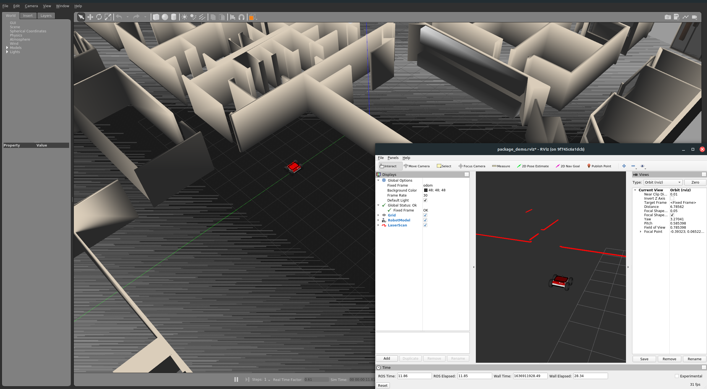

# ROS demo

This is simple demo to make it easier to begin with ROS ecosystem. It was written with respect to tools mostly used in industry in 2021 which is year of writing this demo.

> **CAUTION!** Requirements and installation process for used software can be found in [requirements.md](./requirements.md) 

This demo is based on [ROS Noetic](http://wiki.ros.org/noetic) with [Gazebo](http://gazebosim.org/) simulation environment. Whole system is run from [Docker](https://www.docker.com/) with [docker-compose](https://docs.docker.com/compose/).

# Start simulation
## Linux
``` bash
./start_linux.sh
```
For linux PC with Nvidia graphics card and Nvidia Docker 2 installed.
``` bash
./start_linux.sh -n
```

## Windows
``` bash
docker-compose -f docker/docker-compose-windows.yaml up --build
```

## Usage
At start docker will open two windows. One with Gazebo simulation and one with Rviz. Start of Gazebo might take up to two minutes at first so don't worry it takes lot's of time.


In order to run your code execute this commands:
``` bash
docker container exec -it ros-demo bash
rosrun demo_package follow_the_gap.py
```

This will execute code from [this](./ros_ws/demo_package/scripts/follow_the_gap.py) file. It is a simple follow the gap controller.

## Output

successfully launched simulation should bring you similar windows.

